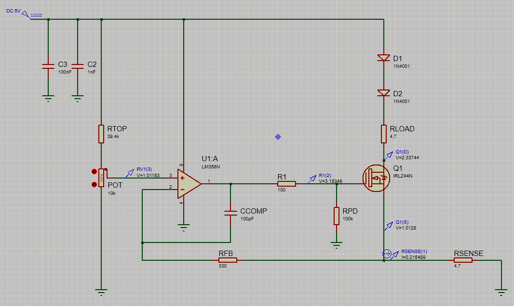

[← Back to Home](../)

---

# Constant-Current Driver — Simulation Note (V2 MOSFET)

## Electronics & Embedded Systems Engineer

Status: Working simulation (closed-loop regulation verified)  
Focus: MOSFET pass element behaviour (VGS requirement) + closed-loop current regulation

---

## Objective

Validate a MOSFET-based constant-current driver (V2) in simulation and confirm closed-loop regulation up to ~200 mA.

Key checks:
- **V+ ≈ V−**
- Current matches **I ≈ VSET / RSENSE**
- Capture the **gate/source voltages** required by the MOSFET in linear operation

---

## Overview (high level)

This is a **closed-loop current regulation** circuit:

- A reference voltage **VSET** is generated by a divider/potentiometer (op-amp **V+**).
- The op-amp compares **V+** to the sensed voltage across **RSENSE** (feedback node into op-amp **V−**).
- The op-amp drives the MOSFET gate to regulate current through the load.
- Regulation target: force **V− ≈ V+**, therefore:

\[
I \approx \frac{V_{SET}}{R_{SENSE}}
\]

In V2 the pass element is a **logic-level N-MOSFET (IRLZ44N)** used in the **linear region** (acting like a controllable resistor).

---

## Schematic (simulation)

Simulation schematic (Proteus): **Figure 1**  
Core topology: **low-side current sink** with MOSFET + shunt feedback.

---

## Simulation Setup

- Supply: **5 V DC**
- Op-amp: **LM358**
- Pass device: **IRLZ44N** (N-MOSFET)
- Sense resistor: **RSENSE = 4.7 Ω**
- Load (simple “laser emulator”): **2× 1N4001 in series + RLOAD = 4.7 Ω**
- Reference network: **RTOP = 39.4 kΩ**, **RV1 = 10 kΩ pot** (VSET adjustable)
- Gate network: **RGATE = 100 Ω**, **RPD = 100 kΩ** (pull-down)
- Feedback resistor present: **RFB = 330 Ω** (series in the feedback path as drawn)

Primary validation method: confirm **V+ ≈ V−** and use Ohm’s law on **RSENSE** to confirm current.

---

## Key Measurements (full-scale / pot at 100%)

At full scale the divider produced:

- **VSET / Op-amp V+ ≈ 1.02 V**
- **Op-amp V− (sense node) ≈ 1.02 V**

→ Regulation confirmed (**V+ ≈ V−**)

Measured / inferred at full scale:

- **I ≈ 215 mA**

Check:

\[
I \approx \frac{1.02}{4.7} \approx 0.217\ \text{A}
\]

Gate / source operating point:

- Gate voltage (after RGATE): **~3.19 V**
- Source / sense node: **~1.02 V**

Therefore:

\[
V_{GS} \approx 3.19 - 1.02 \approx 2.17\ \text{V}
\]

This indicates the MOSFET requires approximately **~2.2 V of VGS** to sustain **~200 mA** at this operating point (linear region).

Additional useful node (from the schematic probes):

- Node above MOSFET (after the diode + RLOAD stack): **~2.33 V**

Approximate MOSFET headroom:

\[
V_{DS} \approx 2.33 - 1.02 \approx 1.31\ \text{V}
\]

---

## Notes / Interpretation

- Closed-loop behaviour looks healthy: **V+** and **V−** match closely at full scale, indicating the op-amp is regulating as intended.
- MOSFET drive requirement is visible: even with **VSET ≈ 1 V**, the op-amp output must rise to **~3.2 V** to provide sufficient **VGS** for **~200 mA**.
- Headroom matters: with a **5 V** supply, the diode stack + resistive load + sense resistor consume several volts, leaving limited **VDS** for regulation. The circuit still reaches **~200 mA** in simulation, but available margin is not large.

---

## What I Learned

- A MOSFET current sink still follows the same control law: **I ≈ VSET / RSENSE** (when the loop is in regulation).
- In linear operation, the MOSFET needs a non-trivial **VGS** (here **~2.2 V at ~0.2 A**), which the op-amp must be able to provide.
- With low supply voltage and a “diode-like” load, voltage budget/headroom becomes a real design constraint (dropout behaviour).

---

## Next Steps

- Tune **VSET,max** to target **~200 mA** exactly (reduce VSET,max from **~1.02 V** to **~0.94 V**, e.g., adjust **RTOP**).
- Add/verify decoupling near the LM358 (e.g., **100 nF across VCC–GND**) and capture an oscilloscope plot in a future bench build (optional stability evidence).
- Compare measured bench **VGS/VDS** against simulation to quantify model vs reality.
