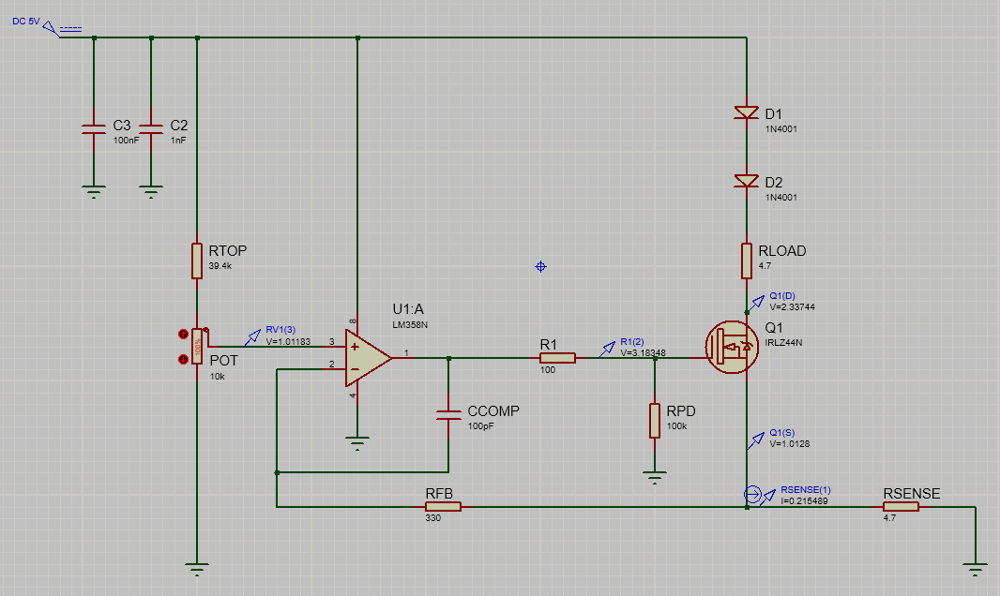

[← Back to Home](../)

---

# Constant-Current Driver — (V2 MOSFET)

Status: Simulation verified + breadboard validated (closed-loop regulation confirmed)  
Focus: MOSFET linear-region behaviour (VGS requirement) + closed-loop current regulation

---

## Objective

Validate a MOSFET-based constant-current driver (V2) in simulation and confirm closed-loop regulation on a breadboard up to ~200 mA.

Key checks:
- **V+ ≈ V−**
- Current matches **I ≈ VSET / RSENSE**
- Capture the **gate/source/drain voltages** required by the MOSFET in linear operation

---

## Overview (high level)

This is a **closed-loop current regulation** circuit:

- A reference voltage **VSET** is generated by a divider/potentiometer (op-amp **V+**).
- The op-amp compares **V+** to the sensed voltage across **RSENSE** (feedback node into op-amp **V−**).
- The op-amp drives the MOSFET gate to regulate current through the load.
- Regulation target: force **V− ≈ V+**, therefore:

When the loop is in regulation (V+ ≈ V−), the op-amp forces the shunt voltage across RSENSE to match the setpoint VSET.  
As a result, the load current is approximately:

**I_LOAD ≈ VSET / RSENSE**

In V2 the pass element is a **logic-level N-MOSFET (IRLZ44N)** used in the **linear region** (acting like a controllable resistor).

---

## Schematic (simulation)

Simulation schematic (Proteus): **Figure 1**  
Core topology: **low-side current sink** with MOSFET + shunt feedback.

---

## Simulation Setup

- Supply: **5 V DC**
- Op-amp: **LM358**
- Pass device: **IRLZ44N** (N-MOSFET)
- Sense resistor: **RSENSE = 4.7 Ω**
- Load (simple “laser emulator”): **2× 1N4001 in series + RLOAD = 4.7 Ω**
- Reference network: **RTOP = 39.4 kΩ**, **RV1 = 10 kΩ pot** (VSET adjustable)
- Gate network: **RGATE = 100 Ω**, **RPD = 100 kΩ** (pull-down)
- Feedback resistor present: **RFB = 330 Ω** (series in the feedback path as drawn)

Primary validation method: confirm **V+ ≈ V−** and use Ohm’s law on **RSENSE** to confirm current.

---

## Key Measurements (simulation full-scale / pot at 100%)

At full scale the divider produced:

- **VSET / Op-amp V+ ≈ 1.02 V**
- **Op-amp V− (sense node) ≈ 1.02 V**

→ Regulation confirmed (**V+ ≈ V−**)

Measured / inferred at full scale:

- **I ≈ 217 mA**

Check:

\[
I \approx \frac{1.02}{4.7} \approx 0.217\ \text{A}
\]

Gate / source operating point:

- Gate voltage (after RGATE): **~3.19 V**
- Source / sense node: **~1.02 V**

Therefore:

`VGS ≈ 3.19 V − 1.02 V ≈ 2.17 V`

Additional useful node (from the schematic probes):

- Node above MOSFET (after the diode + RLOAD stack): **~2.33 V**

Approximate MOSFET headroom:

`VDS ≈ 2.33 V − 1.02 V ≈ 1.31 V`

---

## Breadboard Verification (measured)

Breadboard measurements were taken using the same core topology and reference method (**I ≈ VRSENSE / RSENSE**), with the supply measured at:

- **VSUPPLY (measured) = 4.97 V**

A faulty/out-of-spec LM358 device initially prevented the loop from closing (**V− remained below V+ despite adequate VDS headroom**). Replacing the LM358 restored normal regulation (**V+ ≈ V−**) and the circuit behaved consistently with simulation.

---

## Key Measurements (breadboard)

### Full-scale point (~200 mA)

Measured node voltages:

- **V+ = 0.98 V**
- **V− = 0.97 V**
- **Op-amp output (Vout) = 3.21 V**
- **MOSFET gate = 3.19 V**
- **MOSFET drain = 2.41 V**
- **MOSFET source = 0.97 V**

Current (from shunt):

\[
I \approx \frac{0.97}{4.7} \approx 0.206\ \text{A}
\]

Derived operating point:

- `VGS ≈ 3.19 − 0.97 ≈ 2.22 V`
- `VDS ≈ 2.41 − 0.97 ≈ 1.44 V`

Estimated dissipation at this point:

- `PMOSFET ≈ I·VDS ≈ 0.206·1.44 ≈ 0.30 W`
- `PRSENSE ≈ I²R ≈ (0.206²)·4.7 ≈ 0.20 W`

Thermal observation: the MOSFET became slightly warm but remained comfortable to touch during these short tests, consistent with the estimated power.

---

### Multi-point measurements (50 / 100 / 150 mA setpoints)

| Setpoint | V+ (V) | V− (V) | Vout (V) | Gate (V) | Drain (V) | Source (V) | Icalc = Vsource/4.7 (mA) | VDS = Vd−Vs (V) |
|---:|---:|---:|---:|---:|---:|---:|---:|---:|
| 50 mA  | 0.27 | 0.27 | 2.35 | 2.34 | 3.24 | 0.27 | 57  | 2.97 |
| 100 mA | 0.52 | 0.51 | 2.65 | 2.64 | 2.95 | 0.51 | 109 | 2.44 |
| 150 mA | 0.72 | 0.72 | 2.90 | 2.89 | 2.27 | 0.74 | 157 | 1.53 |

Notes:
- The loop remains in regulation across the range (**V+ ≈ V−**, typically within ~10 mV).
- The measured current is slightly above nominal at low currents (expected from resistor tolerances, op-amp offset, and potentiometer resolution at small VSET).

---

## Notes / Interpretation

- Closed-loop behaviour is confirmed in both simulation and hardware: **V+** and **V−** track closely, indicating correct regulation.
- The MOSFET drive requirement is clear in measured data: even with **VSET < 1 V**, the op-amp output rises to **~3 V** to provide **~2.1–2.2 V of VGS** for tens to hundreds of mA in linear operation.
- Headroom is adequate in this setup: measured **VDS** stays positive and provides margin for regulation across the tested current range.

---

## What I Learned

- A MOSFET current sink still follows the same control law: **I ≈ VSET / RSENSE** (when the loop is in regulation).
- In linear operation, the MOSFET requires a non-trivial **VGS**; in this build it was typically **~2.1–2.2 V** across 50–200 mA, which the op-amp must be able to provide.
- Practical bench validation can reveal real component issues: replacing the LM358 device restored normal closed-loop behaviour, highlighting the value of A/B testing during bring-up.
- Power dissipation is manageable at these current levels, but estimating **I·VDS** is essential when operating a MOSFET in the linear region.
