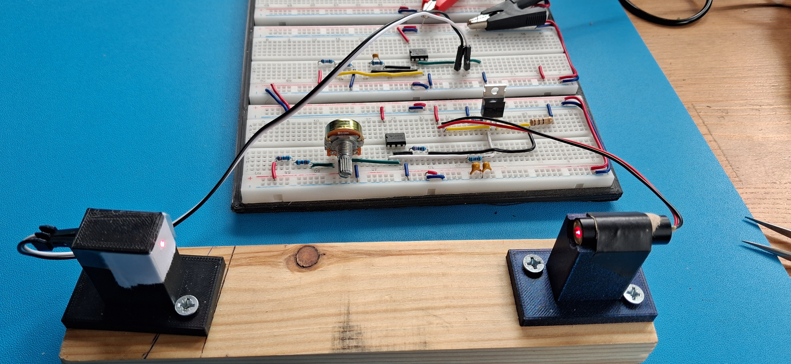

[← Back to Home](../)

---

# Optical Power Measurement System — Real Laser Detection Stage

This project extends the earlier **photodiode TIA validation** by replacing the previous LED-based optical source with a **real red laser module** and testing whether the receiver chain could still operate reliably in real hardware.

The receiver stage used a **BPW34 photodiode** and an **MCP6002-based transimpedance amplifier (TIA)**, while the laser source was driven using the existing **LM358 + MOSFET current driver** arrangement.

The goal of this phase was not to create a precision optical power meter, but to verify that a real laser source could be detected **repeatably** using the same analogue front end, while working through the practical problems introduced by real optics, real hardware, and breadboard implementation.

This work forms part of the broader **Optical Power Measurement System** track, where a controlled optical source is detected by a photodiode front end and converted into a measurable analogue voltage.

---

## Project Objective

The objective of this phase was to confirm that:

- a **real laser source** could be detected by the existing **BPW34 + MCP6002 TIA**
- the optical coupling could be controlled well enough to avoid invalid readings
- the system could produce a **repeatable voltage difference** between illuminated and blocked conditions
- practical issues such as ambient light, optical geometry, and component faults could be identified and resolved in hardware

Rather than focusing on absolute calibrated laser power measurement, this stage focused on **repeatable relative detection** under fixed geometry.

---

## System Overview

The setup used:

- **Laser source:** Adafruit red laser module (~650 nm, low-power visible laser)
- **Laser driver:** LM358 + MOSFET current driver
- **Photodiode:** BPW34
- **TIA op-amp:** MCP6002
- **Supply:** nominal 5 V system
- **TIA feedback network:** 100 kΩ and 22 pF
- **Mechanical arrangement:** fixed supports on a wooden rail
- **Optical shielding:** black 3D-printed photodiode enclosure
- **Optical input control:** small entrance aperture of roughly **1 mm**

The photodiode and laser were held in fixed supports to keep the optical geometry as stable as possible during repeated measurements.

---

## Hardware Setup

## Hardware Setup

*Bench-built laser detection setup showing the real hardware implementation, including the analogue front-end, laser source, and fixed optical geometry used for repeatable measurements.*

---

## Why this phase mattered

The earlier TIA and LED stages showed that the analogue front end worked in principle, but moving from an LED to a real laser introduced several practical differences:

- much higher optical power density
- stronger sensitivity to alignment
- dependence on optical aperture and beam coupling
- sensitivity to ambient room light
- increased risk of misinterpreting electrical effects as optical response

This made the laser stage more representative of real optical hardware work than an idealised simulation-only result.

---

## Main practical problems encountered

This phase was useful partly because the first apparent results were **not immediately trustworthy**, and the debugging process exposed several real hardware issues.

### 1. False initial interpretation
At one point, the output appeared to change when the laser driver potentiometer was moved, but blocking the laser beam did not change the reading. This showed that the observed variation was not yet true optical detection.

### 2. Broken photodiode lead
Further inspection revealed a **broken BPW34 lead**, which explained why the receiver was not responding properly to light.

### 3. Photodiode polarity error
After restoring the photodiode connection, the TIA still did not behave correctly until the **BPW34 polarity was reversed**. With the photodiode connected the wrong way round, the photocurrent drove the TIA in the wrong direction and the op-amp output pushed toward the positive rail.

Once the photodiode polarity was corrected, the TIA returned to normal operation and began responding properly to laser illumination.

### 4. Ambient light sensitivity
Changing daylight conditions in the room affected the reading, so the tests were repeated with the blinds closed to reduce ambient optical interference. Even then, some real-world variation remained, which was useful to document as part of the practical limitations of the setup.

---

## Electrical observations

The TIA bias/reference node was measured at approximately mid-supply, with the receiver front end operating around the expected bias region once the photodiode polarity issue was corrected.

An important debugging observation was that:

- with the photodiode disconnected, the TIA output returned close to the bias point
- with the photodiode connected in reverse, the op-amp output moved toward the positive rail
- with the corrected photodiode polarity, the output returned to a valid operating range and responded to laser illumination

This confirmed that the final voltage changes were caused by **real optical detection**, not just by driver interaction or supply movement.

---

## Final measurement method

To improve repeatability:

- the laser and photodiode were kept in **fixed supports**
- the photodiode enclosure remained **shielded from ambient light**
- a **small optical aperture** of roughly **1 mm** was used at the enclosure input
- the potentiometer was left **unchanged** during repeated measurements
- the laser beam was either allowed through or physically blocked to produce the two main states

The TIA output voltage was measured between **GND** and the **MCP6002 output**.

---

## Measured Results

### Repeated measurements — laser ON

`2.776 V, 2.772 V, 2.772 V, 2.771 V, 2.772 V, 2.772 V, 2.772 V, 2.772 V, 2.773 V, 2.773 V`

- **Mean ON = 2.7725 V**
- **Range ON = 5 mV**

### Repeated measurements — laser blocked / OFF

`2.514 V, 2.513 V, 2.513 V, 2.513 V, 2.513 V, 2.513 V, 2.513 V, 2.514 V, 2.515 V, 2.514 V`

- **Mean OFF = 2.5138 V**
- **Range OFF = 2 mV**

### Output shift

`ΔV = 2.7725 V - 2.5138 V ≈ 0.2587 V`

So the measured separation between the two states was approximately:

- **ΔV ≈ 259 mV**

This was large compared with the spread within each measurement group, which indicates a clear and repeatable optical response.

---

## Intermediate optical checks

Additional spot checks were made by placing simple objects in the beam path to see whether the receiver could detect **intermediate optical conditions** between fully illuminated and blocked states.

Measured examples:

- **Laser ON:** `~2.7725 V`
- **Magnifying lens inserted:** `2.612 V`
- **Opaque plastic inserted:** `2.548 V`
- **Laser blocked / OFF:** `~2.5138 V`

These values suggest that the receiver chain was not only able to distinguish **ON** and **OFF** conditions, but also responded to **partial optical perturbations** introduced in the beam path.

These checks were treated as **practical intermediate test points**, not as calibrated measurements of transparency or optical attenuation.

---

## Comparison with simulation and ideal expectations

This phase highlighted an important difference between simulation and real hardware.

The simulation was useful for validating the core TIA concept:

- photodiode current-to-voltage conversion
- operation around a mid-supply bias point
- expected output movement with changing optical input

However, the real bench setup introduced practical effects that were not captured as cleanly in simulation, including:

- photodiode polarity mistakes
- broken component leads
- supply and breadboard non-idealities
- strong dependence on optical geometry
- ambient light interference
- non-ideal beam behaviour from a low-cost laser module

In other words, the simulation validated the **principle**, but the real hardware forced the design to be debugged and constrained before the result became trustworthy.

---

## Conclusion

This phase successfully demonstrated **repeatable real-laser detection** using a **BPW34 photodiode** and **MCP6002 transimpedance amplifier** under fixed geometry.

The final setup produced a stable voltage separation of approximately **259 mV** between laser-illuminated and blocked conditions, confirming that the TIA could detect a real laser source in hardware once the optical input was constrained and the photodiode polarity was corrected.

Just as importantly, this phase exposed several real-world issues that do not appear clearly in ideal simulation alone, including component faults, polarity sensitivity, ambient light influence, and the importance of controlled optical coupling.

Overall, this stage strengthened the project by showing not only that the optical receiver could work, but also how real engineering debugging was required to make the result valid.
