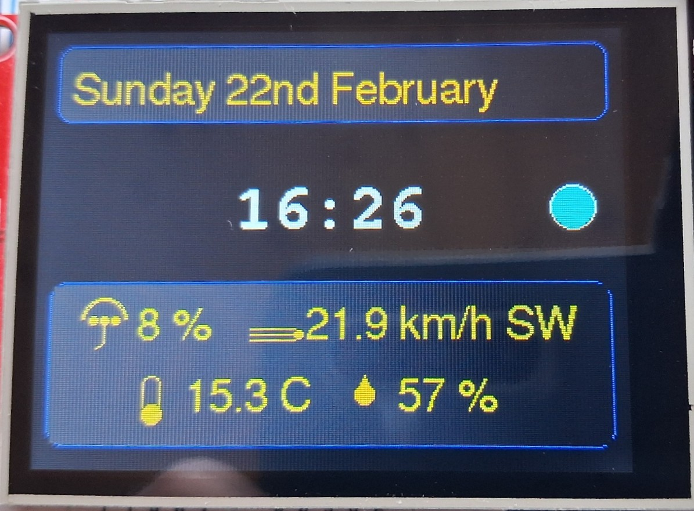
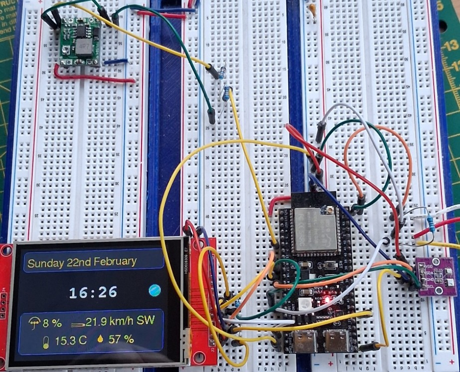
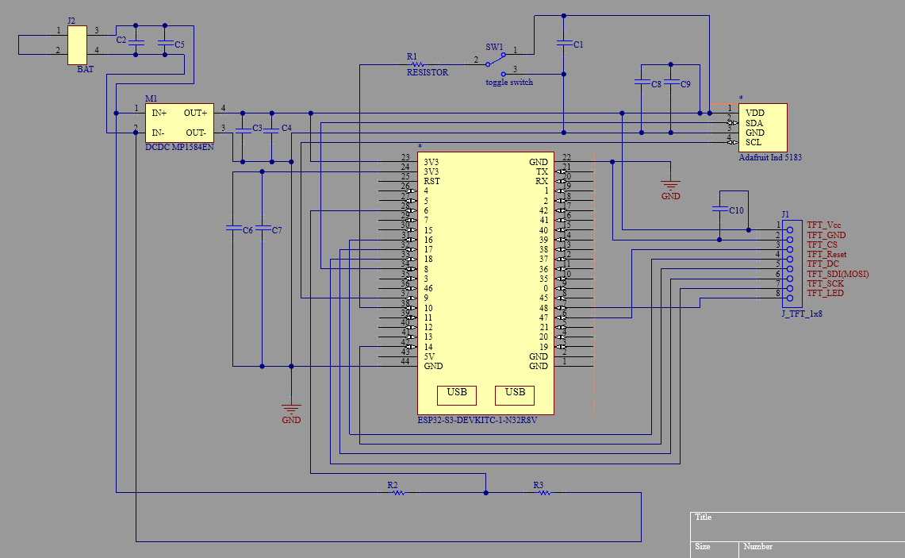
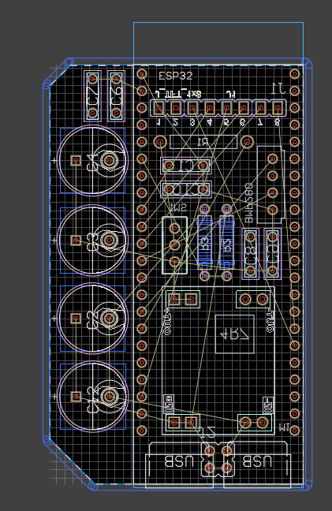
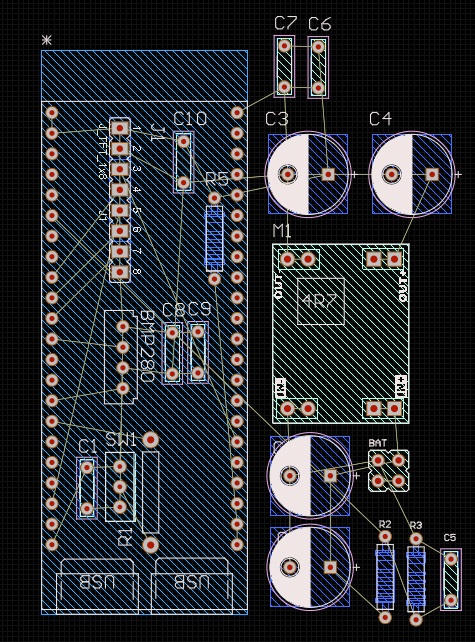

[← Back to Home](../)

---

# Embedded Clock and Weather Station — ESP32-S3

**Status:** Working validated prototype  
**Focus:** Embedded system integration, sensor/display interfacing, time synchronisation, forecast retrieval, and battery-powered operation

---

## Project Objective

This project aimed to build a practical standalone embedded device that combines accurate time display, indoor environmental sensing, and online weather forecast data in a single battery-powered system.

Beyond the end-user function, the project was useful as an exercise in real embedded integration: combining sensors, display control, network access, power conversion, battery monitoring, and firmware-level data handling in one working prototype.

---

## Why this project matters

This was not just a display project. It required coordination across multiple embedded subsystems:

- sensor acquisition
- graphical display output
- Wi-Fi-based data retrieval
- time synchronisation with timezone handling
- battery-powered operation with voltage monitoring

The value of the project lies in system-level integration rather than any single feature on its own.

---

## System Architecture

This is a single-node embedded system built around an **ESP32-S3**.

Main subsystems:

- **Display:** ILI9341 TFT over SPI for a clear, glanceable interface
- **Sensors:** AHT20 for temperature/humidity and BMP280 for pressure
- **Connectivity:** Wi-Fi enabled on demand for:
  - **NTP time synchronisation** with UK timezone handling (GMT/BST)
  - **Open-Meteo forecast retrieval** for rain probability and wind conditions
- **Power:** 2 × 18650 cells with an **MP1584EN buck regulator**
- **Battery monitoring:** resistor divider to ADC input, with firmware calibration and smoothing

This architecture was chosen to balance usability, power efficiency, and practical standalone operation.

---

## Evidence (photos)

### Working display (time, indoor conditions, and forecast)

### Hardware / prototype build

---

## Circuit Schematic

Schematic showing the main hardware blocks and interconnections:

---

## Main Hardware Elements

- **MCU:** ESP32-S3 (N16R8)
- **Display:** ILI9341 TFT over SPI
- **Sensors:** AHT20 and BMP280
- **Power stage:** 2 × 18650 cells + MP1584EN buck regulator
- **Battery measurement path:** resistor divider into ADC, calibrated in firmware

---

## Forecast Integration

Forecast data is retrieved from **Open-Meteo** for the configured location.

Displayed forecast values include:

- **Rain probability (%)**
- **Wind speed (km/h)**
- **Wind direction** converted from degrees to cardinal direction

This forecast information is combined with local indoor measurements so the device presents both:

- expected outdoor conditions from online forecast data
- actual measured indoor conditions in the workspace

This combination makes the display more useful than either a simple clock or a basic indoor sensor display on its own.

---

## Power-Aware Design Approach

The system was designed with battery operation in mind.

Key power-saving decisions included:

- **Wi-Fi enabled only when needed**, rather than left active continuously
- **Deep sleep used as the main low-power mode**, depending on the selected wake strategy
- **Battery voltage measurement stabilised in firmware** using calibration and smoothing

This made the design more suitable for practical standalone operation instead of permanent USB-powered use.

---

## Power Measurements

Bench PSU measurements were used to estimate practical current consumption.

**Test conditions**
- Supply voltage: **3.417 V** steady-state, **3.468 V** observed at startup
- Display: **ON**
- Measurement source: bench PSU current readout

| Operating state | Supply voltage (V) | Current (mA) | Notes |
|---|---:|---:|---|
| Startup / boot | ~3.468 | ~40 | Initial boot and display initialisation |
| Idle (display ON, no sensor/forecast update) | ~3.417 | ~15 | Stable draw while showing the UI |
| Data update (sensor / forecast fetch) | varies | transient | Short spikes during updates, low average impact due to short duration and ~20 min interval |

### Interpretation

The update-related current spikes were brief and infrequent, so average consumption was dominated mainly by the steady idle current while the display remained active.

This helped confirm that the main power trade-off in the design is the always-on display state, rather than occasional network activity.

---

## PCB Iterations

### 1) Discarded PCB version

This version was rejected because component spacing was too tight for comfortable assembly, inspection, and rework.

### 2) Recommended PCB direction

This version improved spacing and general layout, making it a better basis for final assembly and enclosure integration.

This iteration process was valuable in itself: it reinforced that practical PCB design is not only about fitting components, but also about assembly comfort, serviceability, and real-world build quality.

---

## Engineering Takeaways

- A useful embedded product often comes from **integration quality**, not from any single feature alone
- Accurate local time display can be maintained reliably with periodic **NTP synchronisation** and correct timezone handling
- Combining **local sensing** with **online forecast retrieval** creates a more informative system than either function on its own
- Battery-powered embedded design benefits from treating **Wi-Fi and display behaviour as power decisions**
- Early PCB revisions are part of the engineering process, especially when moving from proof-of-concept to buildable hardware

---

## Current Development Status

The prototype is functionally validated, with final integration still pending on the populated PCB and 3D-printed enclosure.

Planned remaining work includes:

- populating and validating the recommended PCB
- confirming power behaviour under real battery conditions
- completing enclosure design with serviceability in mind
- optionally extending the measurement section with more detailed current data for idle, Wi-Fi activity, and deep sleep
