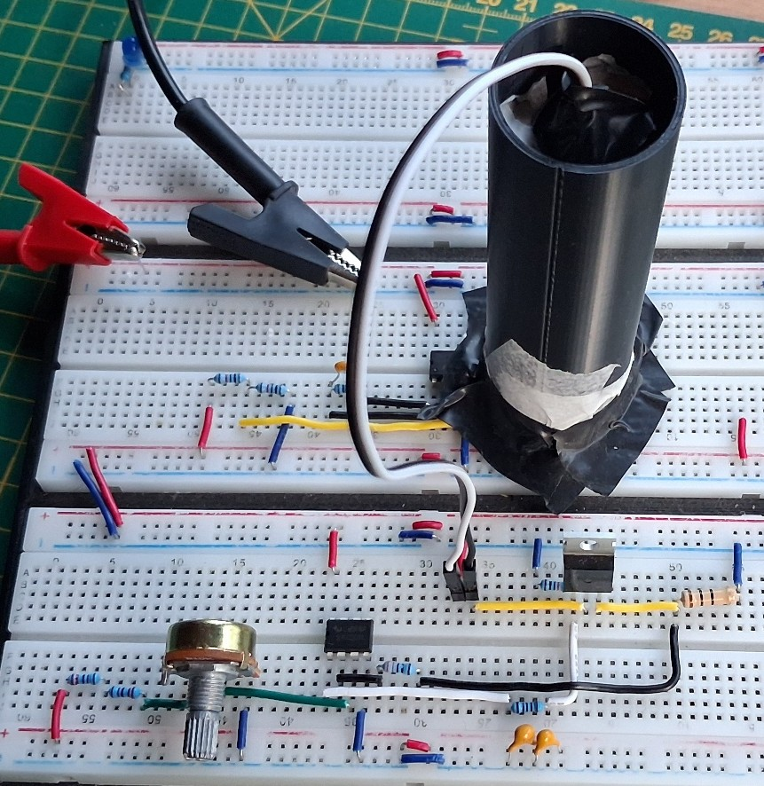

[← Back to Home](../)

---

# LED-Driven Optical Measurement Chain — Current Driver + Photodiode TIA

This project validates the integration of a **current-controlled optical emitter** with a **photodiode analogue front end**, combining a **MOSFET-based current driver**, a **red LED emitter**, and a **BPW34 + MCP6002 transimpedance amplifier (TIA)**.

The goal of this stage was to verify that variations in emitter drive current produce a measurable and repeatable response at the TIA output, completing a full **electro-optical measurement chain** in real hardware.

This work builds directly on the previous TIA validation stage and represents an intermediate step before introducing a **laser-based emitter**.

---

## Project Objective

The objective of this stage was to confirm:

- controlled LED current produces a predictable change in emitted optical power  
- the photodiode + TIA stage responds to changes in incident optical irradiance  
- the full emitter–detector chain behaves consistently under fixed geometric conditions  

The expected system-level relationship is:

`I_LED ↑ → Optical Output ↑ → IPD ↑ → Vout_TIA changes`

---

## Circuit Overview

The system is composed of two main blocks:

### Current Driver (Emitter Side)
- **Op-amp:** LM358  
- **MOSFET:** Logic-level N-channel  
- **Sense resistor:** 10 Ω  
- **Control:** Potentiometer (Vset)  

The driver regulates LED current using closed-loop feedback:

`I_LED ≈ Vset / Rsense`

---

### Photodiode + TIA (Receiver Side)
- **Photodiode:** BPW34  
- **Op-amp:** MCP6002  
- **Supply:** 5 V  
- **Reference voltage:** 2.5 V  
- **Feedback resistor:** 100 kΩ  
- **Feedback capacitor:** 22 pF  

The TIA converts photodiode current into a measurable voltage:

`Vout ≈ Vref + (IPD × Rf)`

---

## Experimental Setup

The LED emitter and photodiode were aligned inside a **3D-printed black tube**, creating an enclosed optical path of approximately **7.5 cm**.

This setup significantly reduced ambient light interference and improved measurement repeatability, ensuring that variations in TIA output were primarily due to changes in LED emission rather than external lighting conditions.

---

## Measurements

| Rsense Voltage (V) | LED Current (mA) | TIA Output (V) |
|---:|---:|---:|
| 0.408 | 40.8 | 2.477 |
| 0.531 | 53.1 | 2.472 |
| 0.626 | 62.6 | 2.468 |
| 0.760 | 76.0 | 2.460 |
| 0.912 | 91.2 | 2.454 |

---

## Results and Discussion

The results show a clear monotonic response: as LED drive current increased, the TIA output shifted consistently.

This confirms that the photodiode front-end responds proportionally to the **incident optical irradiance** produced by the emitter, validating the complete electro-optical signal chain.

The observed voltage variation (~23 mV across the test range) is relatively small, which is consistent with the enclosed geometry and emitter–detector separation of approximately 7.5 cm. The optical coupling in this configuration is moderate, but the response remains stable and repeatable.

---

## Why this project matters

This stage demonstrates a key system-level capability:

- electrical control of an optical emitter  
- optical transmission through a defined geometry  
- photodetection and analogue conversion into a measurable voltage  

It represents the transition from isolated circuit blocks to a **functional electro-optical measurement system**, forming the foundation for more advanced implementations.

---

## Next Steps

The next stage will replace the LED emitter with a **laser diode**, enabling:

- higher optical intensity and improved coupling  
- better signal-to-noise ratio  
- potential calibration towards optical power measurement  

This LED-based implementation provides a safe, low-cost, and fully validated intermediate step before moving to laser-based systems.
