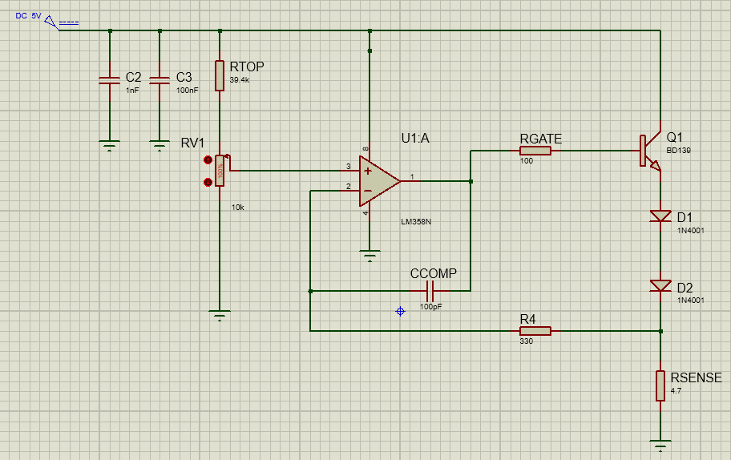

# Constant-Current Driver — Bench Verification Note

**Status:** Working prototype (bench verified)  
**Focus:** Closed-loop current regulation + measurement discipline (ammeter burden) + thermal behaviour

---

## Objective
Validate the driver’s output current across multiple setpoints and document key bench measurements.  
A secondary objective was to capture a real-world measurement pitfall discovered during testing: **ammeter burden / instrument loading** (the act of measuring current changed the current).

---

## Overview (high level)
This is a closed-loop current regulation circuit:

- A **reference voltage** is generated by a divider/potentiometer.
- An **op-amp** compares the reference (V+) to the feedback node (V−).
- The op-amp drives a **BJT pass element** to regulate the current through a resistive load.

This project intentionally focuses on **verification**: cross-checking measurements, documenting errors, and understanding thermal limits.

---

## Schematic & Build Evidence
**Simulation schematic (Proteus):**  
> Replace the path below with the real image path in your repo (if different).

**Breadboard build photo:**  
> Replace with the real breadboard photo filename/path.

---

## Test Setup
- **Supply:** ~5 V bench PSU  
- **Load:** **4.7 Ω** resistor (measured out-of-circuit with a DMM)  
- **Measurement tools:** DMM(s) + PSU current readback  
- **Primary current method:** **Icalc = VRload / 4.7 Ω** (avoids ammeter loading)

---

## Key Measurements (full-scale / pot at 100%)

| Node | Measured value |
|---|---:|
| PSU terminals | 4.991 V |
| On-board input (before divider) | 4.836 V |
| Divider output / Op-amp V+ | 0.992 V |
| Op-amp V− | 0.991 V |
| Op-amp output | 3.339 V |
| BJT collector | 4.836 V |
| BJT emitter | 2.582 V |
| BJT base | 3.284 V |
| Load voltage across 4.7 Ω | 0.991 V |

**Notes**
- The supply dropped from 4.991 V at the PSU to 4.836 V on the circuit (~0.155 V), consistent with lead/contact resistance.
- Regulation looked healthy at full scale: **V+ ≈ V− within ~1 mV**, indicating stable closed-loop control.

---

## Ammeter Burden / Instrument Loading (why series current readings were misleading)
When measuring current by inserting an ammeter in series, the operating point shifted because the meter introduced a voltage drop (burden).

Measured during testing:
- The measured voltage across the series path (load resistor + ammeter) was approximately 0.986 V.
- Meter drop: The voltage drop across the ammeter itself (its burden voltage) was approximately 0.21 V.
- Load voltage: Since the total drop across the series path (load resistor = ammeter) was ~0.986 V, the load resistor drop is the remainder:
  Vload ​≈ 0.986 − 0.21 = 0.776 V.
- Resulting current: With Rload = 4.7 Ω, the current through the load is:
  I ≈ Vload​ / Rload ​≈ 0.776 / 4.7 ≈ 0.165A → ~165 mA.

Estimated meter series resistance:
- Estimated meter resistance (burden): The ammeter can be modelled as a small series resistance that causes the  measured meter drop. Using Ohm's law, the equivalent resistance is:
  Rmeter ≈ Vmeter​ / I ≈ 0.21 / 0.165 ≈ 1.27Ω.

**Conclusion:** the ammeter reduced the current by adding significant series resistance.  
For development measurements, current was verified primarily using **V/R** across the known load resistor (or a low-burden measurement method).

---

## 4-Point Characterisation (50 / 100 / 150 / ~200 mA)

To avoid measurement loading, output current was primarily verified using **Ohm’s law across the known load resistor**:

- Load resistor: **Rload = 4.7 Ω**
- Current estimate: **Icalc = VRload / 4.7 Ω**
- Control loop check: **V+ ≈ V−** at each setpoint

### Results table

| Setpoint | Vin (board, before divider) | Vref divider node | V+ (op-amp) | V− (op-amp) | Op-amp Vout | VRload (across 4.7 Ω) | Icalc (VRload/4.7) | Iout (reported) | Vc (BJT) | Ve (BJT) | VCE (Vc−Ve) | PBJT ≈ VCE·Icalc |
|---:|---:|---:|---:|---:|---:|---:|---:|---:|---:|---:|---:|---:|
| 50 mA | 4.921 V | 1.008 V | 0.252 V | 0.251 V | 2.501 V | 0.250 V | **53.2 mA** | 50 mA | 4.923 V | 1.786 V | 3.137 V | **~0.167 W** |
| 100 mA | 4.854 V | 0.992 V | 0.485 V | 0.484 V | 2.793 V | 0.484 V | **103.0 mA** | 102 mA | 4.863 V | 2.059 V | 2.804 V | **~0.289 W** |
| 150 mA | 4.781 V | 0.980 V | 0.708 V | 0.707 V | 3.055 V | 0.707 V | **150.4 mA** | 149 mA | 4.739 V | 2.300 V | 2.439 V | **~0.367 W** |
| ~200 mA (full-scale) | 4.836 V | 0.992 V | 0.992 V | 0.991 V | 3.339 V | 0.991 V | **210.9 mA** | ~199–201 mA (PSU stable) | 4.836 V | 2.582 V | 2.254 V | **~0.476 W** |

### Notes / Interpretation
- **Closed-loop behaviour:** At all points, **V+ and V− match within ~1 mV**, indicating the op-amp is regulating as expected.
- **Current verification:** The calculated current from **VRload/4.7 Ω** closely matches the reported current values, and avoids the measurement loading seen when inserting an ammeter in series.
- **Thermal explanation:** the pass transistor operates in the **linear region**, so dissipation is approximately **PBJT ≈ VCE · I**.  
  At full scale, dissipation approaches **~0.48 W**, which explains rapid heating without a heatsink.
- **Supply/lead effects:** Vin on the board decreases with load current, consistent with lead/contact resistance and increasing current draw.

---

## Stability improvement (decoupling)
A **100 nF ceramic decoupling capacitor** was added across VCC–GND near the control circuitry, which improved stability at higher current.  
After the change, PSU current readback became significantly steadier near full-scale operation (e.g., **~199–201 mA stable** under airflow).

---

## Thermal mitigation during test
At high current the pass transistor heats rapidly. During extended measurements, a small **PC fan** was used to improve airflow and keep the operating point stable.  
Under airflow, the PSU readback was observed around **~190 mA** with approximately **~0.95 W** input power (order-of-magnitude consistent with ~5 V × ~0.19 A).

---

## What I Learned
- **Measurement can change the circuit:** inserting an ammeter can introduce enough burden to shift the operating point.
- **Cross-checking matters:** V/R across a known resistor is a reliable validation method when the ammeter is intrusive.
- **Thermals are real:** a linear pass device at ~0.2 A can dissipate ~0.5 W and requires a thermal strategy.

---

## Next Steps (v2 improvements)
- Improve thermal management (heatsink / better thermal path) or replace the BJT pass device with a **logic-level MOSFET** to reduce dissipation.
- Add dedicated **test points** and (optionally) a **small sense resistor** to enable low-burden current measurement.
- Capture an oscilloscope screenshot (optional) to confirm stability/ripple at high current.

---
