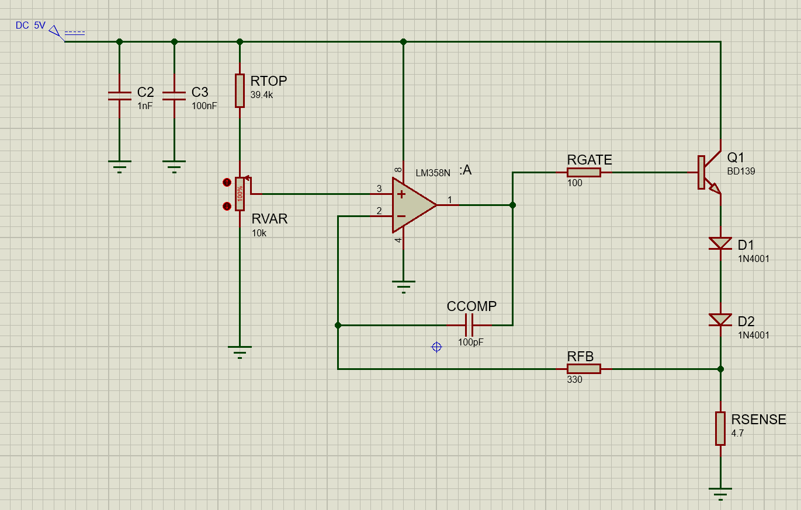
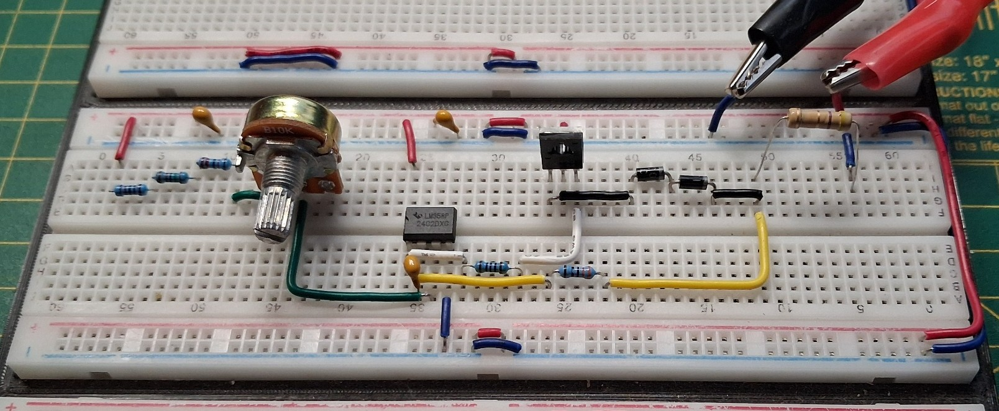

[← Back to Home](../)

---

# Laser Diode Constant-Current Driver — V1 (BJT)

**Status:** Bench-verified working prototype  
**Focus:** Closed-loop current regulation, measurement discipline, and thermal behaviour in a linear driver stage

---

## Project Objective

This project focused on bench validation of a closed-loop constant-current driver prototype across multiple setpoints, with particular attention to regulation behaviour, current-verification method, and pass-device heating.

A secondary objective emerged during testing: documenting a real measurement pitfall in which inserting an ammeter directly into the circuit changed the operating point due to burden voltage. That observation became an important part of the validation process rather than a side note.

---

## Why this project matters

This was not just a circuit build. It was an exercise in verifying how a linear current driver behaves in real hardware, how measurement technique affects interpretation, and how thermal limits begin to matter at higher current.

The project helped establish:
- confidence in the closed-loop control approach
- a practical method for current verification without intrusive measurement loading
- a clearer understanding of dissipation and thermal behaviour in the BJT pass device

---

## Operating Principle

This is a **closed-loop current regulation** circuit.

- A reference voltage (**VSET**) is generated by a divider/potentiometer and applied to the op-amp **V+**
- The op-amp compares this reference against the sensed feedback voltage at **V−**
- The op-amp then drives a **BJT pass element** in its linear region to regulate current through the load

When the loop is in regulation, **V+ ≈ V−**, and the circuit forces the output current to follow the commanded setpoint.

This project deliberately focuses on **verification and interpretation** rather than only on circuit construction.

---

## Schematic and Build Evidence

**Simulation schematic (Proteus):**  

### Breadboard Build (hardware)

Breadboard implementation of the V1 BJT current driver used for bench measurements.

The layout was kept reasonably compact, with short return paths around the sensing region and op-amp ground reference in order to reduce wiring-related error sources during measurement.

---

## Test Setup

- **Supply:** ~5 V bench PSU  
- **Load:** **4.7 Ω** resistor, measured out of circuit with a DMM  
- **Measurement tools:** DMM(s) + PSU current readback  
- **Primary current-verification method:** **Icalc = VRload / 4.7 Ω**

This resistor-based method was preferred because direct series ammeter insertion introduced measurement loading.

---

## Full-Scale Verification

At full-scale adjustment, the following values were measured:

| Node | Measured value |
|---|---:|
| Op-amp V+ | 0.992 V |
| Op-amp V− | 0.991 V |
| Op-amp Vout | 3.339 V |
| BJT base (drive node) | 3.284 V |
| BJT collector | 4.836 V |
| BJT emitter | 2.582 V |
| Load voltage across 4.7 Ω (VRload) | 0.991 V |

### Interpretation

- The loop appeared healthy at full scale, with **V+ and V− matching within ~1 mV**
- Calculated current was:

**I ≈ 0.991 V / 4.7 Ω ≈ 0.211 A (≈ 211 mA)**

This confirmed that the driver reached the intended operating range and that the control loop was functioning as expected.

---

## Ammeter Burden / Instrument Loading

One of the most useful findings during bench work was that measuring current directly with an ammeter changed the circuit’s behaviour.

When the ammeter was inserted in series:

- Total drop across the series path (load resistor + ammeter): **~0.986 V**
- Ammeter burden voltage: **~0.21 V**
- Therefore load-resistor voltage: **Vload ≈ 0.986 − 0.21 = 0.776 V**

This gives:

**I ≈ 0.776 V / 4.7 Ω ≈ 0.165 A (≈ 165 mA)**

The meter can be modelled as an additional series resistance:

**Rmeter ≈ Vmeter / I ≈ 0.21 / 0.165 ≈ 1.27 Ω**

### Practical conclusion

The ammeter significantly reduced current by inserting non-negligible series resistance into the circuit.

For development measurements, current was therefore verified primarily using **V/R across the known load resistor**, which provided a less intrusive and more trustworthy basis for circuit evaluation.

This was an important validation lesson: the measurement method itself can distort the behaviour being measured.

---

## 4-Point Characterisation

To avoid intrusive loading, output current was characterised mainly using **Ohm’s law across the known load resistor**:

- **Rload = 4.7 Ω**
- **Icalc = VRload / 4.7 Ω**
- Regulation check at each point: **V+ ≈ V−**

### Results

| Setpoint | V+ (op-amp) | V− (op-amp) | Op-amp Vout | BJT base (drive) | Vc (BJT) | Ve (BJT) | VRload (4.7 Ω) | Icalc (VRload/4.7) | VCE (Vc−Ve) | PBJT ≈ VCE·Icalc |
|---:|---:|---:|---:|---:|---:|---:|---:|---:|---:|---:|
| 50 mA | 0.252 V | 0.251 V | 2.501 V | 2.43 V | 4.923 V | 1.786 V | 0.250 V | **53.2 mA** | 3.137 V | **~0.167 W** |
| 100 mA | 0.485 V | 0.484 V | 2.793 V | 2.73 V | 4.863 V | 2.059 V | 0.484 V | **103.0 mA** | 2.804 V | **~0.289 W** |
| 150 mA | 0.708 V | 0.707 V | 3.055 V | 3.02 V | 4.739 V | 2.300 V | 0.707 V | **150.4 mA** | 2.439 V | **~0.367 W** |
| ~200 mA | 0.992 V | 0.991 V | 3.339 V | 3.41 V | 4.836 V | 2.582 V | 0.991 V | **210.9 mA** | 2.254 V | **~0.476 W** |

### Interpretation

Several useful patterns appeared across the characterisation table:

- **Closed-loop behaviour remained consistent**, with **V+ and V− matching within ~1 mV** at all tested points
- **Current followed the setpoint predictably**, and the resistor-based verification method avoided the distortion caused by direct ammeter insertion
- **BJT dissipation increased with current**, reaching approximately **0.48 W** near full scale
- **Supply voltage at the board decreased with load current**, consistent with lead/contact resistance and increasing current demand

Overall, the circuit behaved as a valid working prototype and provided meaningful data for evaluating its practical limits.

---

## Stability Improvement

A **100 nF ceramic decoupling capacitor** was added across **VCC–GND** near the control circuitry.

This improved behaviour at higher current, making PSU current readback significantly steadier near full-scale operation. Under airflow, the current appeared stable in the region of **~199–201 mA**.

This was a useful reminder that even simple bench prototypes benefit from local decoupling when the control loop and current path are sharing a practical breadboard environment.

---

## Thermal Behaviour During Test

At higher current, the BJT heated rapidly, as expected for a pass device operating in the linear region.

During extended testing, a small **PC fan** was used to improve airflow and reduce drift caused by rising device temperature. Under airflow, PSU readback was observed around **~190 mA**, with approximately **~0.95 W** input power, which is consistent at order-of-magnitude level with **5 V × 0.19 A**.

This reinforced an important design reality: even in a low-voltage prototype, thermal management becomes relevant once current and voltage drop combine to create meaningful pass-device dissipation.

---

## Engineering Takeaways

- **Measurement technique matters:** inserting an ammeter directly in series can change the operating point enough to mislead interpretation
- **Resistor-based current verification is often more reliable** during development of linear current drivers
- **Closed-loop validation should include both node agreement and current confirmation**
- **Thermal behaviour is part of functional verification**, not just a packaging concern

This V1 prototype successfully validated the control concept and provided the practical bench lessons that informed the later MOSFET-based iteration.
