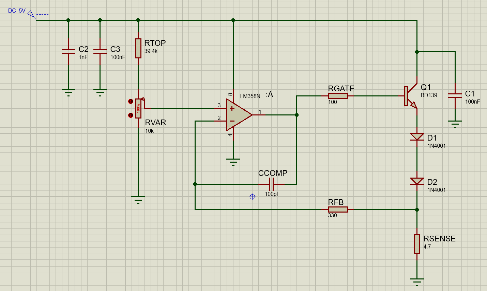

<link rel="stylesheet" href="../project-style.css">

[← Back to Home](../)

---

# Constant-Current Driver — (V1 BJT)

**Status:** Working prototype (bench verified)  
**Focus:** Closed-loop current regulation + measurement discipline (ammeter burden) + thermal behaviour

---

## Objective

Validate the driver’s output current across multiple setpoints and document key bench measurements.  
A secondary objective was to capture a real-world measurement pitfall discovered during testing: **ammeter burden / instrument loading** (the act of measuring current changed the current).

---

## Overview (high level)

This is a **closed-loop current regulation** circuit:

- A **reference voltage (VSET)** is generated by a divider/potentiometer (op-amp **V+**).
- The op-amp compares **V+** to the sensed voltage at the feedback node (op-amp **V−**).
- The op-amp drives a **BJT pass element** operating in the linear region to regulate current through the load.

When the loop is in regulation (**V+ ≈ V−**), the circuit behaves as a current source/sink whose current is set mainly by the sense element (or the load resistor in this test method).  
This project intentionally focuses on **verification**: cross-checking measurements, documenting errors, and understanding thermal limits.

---

## Schematic & Build Evidence

**Simulation schematic (Proteus):**  

## Breadboard Build (hardware)

Breadboard implementation of the V1 BJT current driver used for bench measurements (**Figure 2**).  
The layout was kept compact, with short return paths around the sensing path and the op-amp ground reference to minimise wiring-induced errors.

## Breadboard Verification (measured)

Breadboard measurements were taken using the same core topology and the same reference method (**I ≈ VRload / Rload**).  
Supply voltage was measured at the breadboard before recording node voltages and calculating current.
---

## Test Setup

- **Supply:** ~5 V bench PSU  
- **Load:** **4.7 Ω** resistor (measured out-of-circuit with a DMM)  
- **Measurement tools:** DMM(s) + PSU current readback  
- **Primary current method:** **Icalc = VRload / 4.7 Ω** (avoids ammeter loading)

---

## Key Measurements (full-scale / pot at 100%)

| Node | Measured value |
|---|---:|
| Op-amp V+ | 0.992 V |
| Op-amp V− | 0.991 V |
| Op-amp Vout | 3.339 V |
| BJT base (drive node) | 3.284 V |
| BJT collector | 4.836 V |
| BJT emitter | 2.582 V |
| Load voltage across 4.7 Ω (VRload) | 0.991 V |

**Notes**
- Regulation looked healthy at full scale: **V+ ≈ V− within ~1 mV**, indicating stable closed-loop control.
- Current check (from load resistor): **I ≈ 0.991 V / 4.7 Ω ≈ 0.211 A (≈ 211 mA)**.

---

## Ammeter Burden / Instrument Loading

When measuring current by inserting an ammeter in series, the operating point shifted because the meter introduced a voltage drop (burden).

Measured during testing:
- Total drop across the series path (load resistor + ammeter): **~0.986 V**
- Ammeter burden voltage: **~0.21 V**
- Therefore load resistor drop: **Vload ≈ 0.986 − 0.21 = 0.776 V**
- Resulting current (with Rload = 4.7 Ω):

**I ≈ 0.776 V / 4.7 Ω ≈ 0.165 A (≈ 165 mA)**

The meter can be modelled as a small series resistance:

- **Rmeter ≈ Vmeter / I ≈ 0.21 / 0.165 ≈ 1.27 Ω**

**Conclusion:** the ammeter reduced the current by adding significant series resistance.  
For development measurements, current was verified primarily using **V/R** across the known load resistor (or a low-burden measurement method).

---

## 4-Point Characterisation (50 / 100 / 150 / ~200 mA)

To avoid measurement loading, output current was primarily verified using **Ohm’s law across the known load resistor**:

- Load resistor: **Rload = 4.7 Ω**
- Current estimate: **Icalc = VRload / 4.7 Ω**
- Control loop check: **V+ ≈ V−** at each setpoint

### Results table

| Setpoint | V+ (op-amp) | V− (op-amp) | Op-amp Vout | BJT base (drive) | Vc (BJT) | Ve (BJT) | VRload (4.7 Ω) | Icalc (VRload/4.7) | VCE (Vc−Ve) | PBJT ≈ VCE·Icalc |
|---:|---:|---:|---:|---:|---:|---:|---:|---:|---:|---:|
| 50 mA | 0.252 V | 0.251 V | 2.501 V | 2.43 V | 4.923 V | 1.786 V | 0.250 V | **53.2 mA** | 3.137 V | **~0.167 W** |
| 100 mA | 0.485 V | 0.484 V | 2.793 V | 2.73 V | 4.863 V | 2.059 V | 0.484 V | **103.0 mA** | 2.804 V | **~0.289 W** |
| 150 mA | 0.708 V | 0.707 V | 3.055 V | 3.02 V | 4.739 V | 2.300 V | 0.707 V | **150.4 mA** | 2.439 V | **~0.367 W** |
| ~200 mA | 0.992 V | 0.991 V | 3.339 V | 3.41 V | 4.836 V | 2.582 V | 0.991 V | **210.9 mA** | 2.254 V | **~0.476 W** |

---

## Notes / Interpretation

- **Closed-loop behaviour:** At all points, **V+ and V− match within ~1 mV**, indicating the op-amp is regulating as expected.
- **Current verification:** The calculated current from **VRload/4.7 Ω** closely matches the reported current values, and avoids the measurement loading seen when inserting an ammeter in series.
- **Thermal behaviour:** the pass transistor operates in the **linear region**, so dissipation is approximately **PBJT ≈ VCE · I**.  
  At full scale, dissipation approaches **~0.48 W**, which explains rapid heating without a heatsink.
- **Supply/lead effects:** Vin on the board decreases with load current, consistent with lead/contact resistance and increasing current draw.

---

## Stability improvement (decoupling)

A **100 nF ceramic decoupling capacitor** was added across VCC–GND near the control circuitry, which improved stability at higher current.  
After the change, PSU current readback became significantly steadier near full-scale operation (e.g., **~199–201 mA stable** under airflow).

---

## Thermal mitigation during test

At high current the pass transistor heats rapidly. During extended measurements, a small **PC fan** was used to improve airflow and keep the operating point stable.  
Under airflow, the PSU readback was observed around **~190 mA** with approximately **~0.95 W** input power (order-of-magnitude consistent with ~5 V × ~0.19 A).

---

## What I Learned

- **Measurement can change the circuit:** inserting an ammeter can introduce enough burden to shift the operating point.
- **Cross-checking matters:** V/R across a known resistor is a reliable validation method when the ammeter is intrusive.
- **Thermals are real:** a linear pass device at ~0.2 A can dissipate ~0.5 W and requires a thermal strategy.

---
