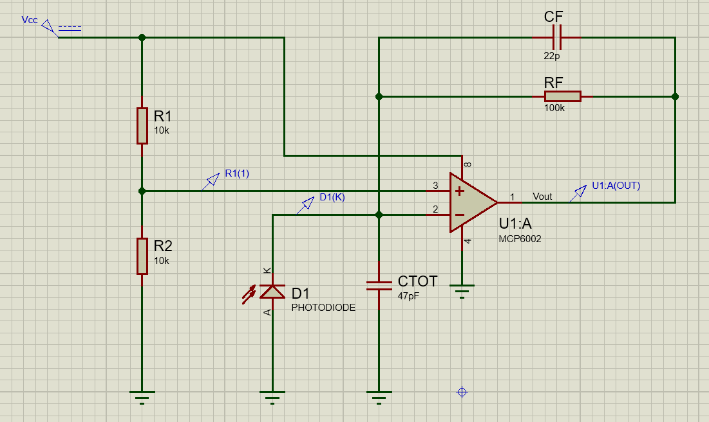
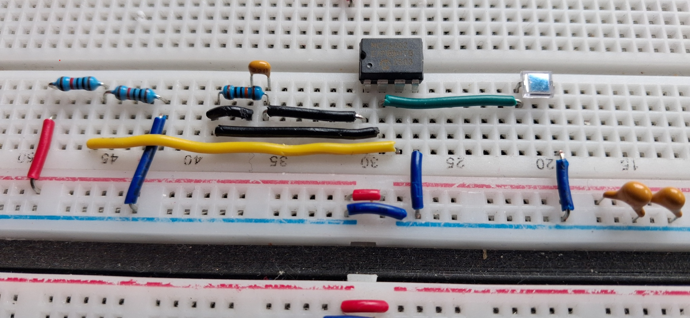

[← Back to Home](../)

---

# Photodiode Transimpedance Amplifier (TIA) — Initial Validation

This project explored the basic analogue front-end stage for an optical power measurement system, using a photodiode and a transimpedance amplifier (TIA) to convert very small sensor current into a measurable voltage.

The objective of this initial validation was to confirm that a single-supply op-amp configuration could provide the expected current-to-voltage conversion behaviour, and to establish a practical starting point for later breadboard implementation.

The circuit was built around the **MCP6002** operating from a **5 V supply**, with a **2.5 V reference** applied to the non-inverting input. A simulated photodiode current was then applied at the inverting input, giving the expected first-order transimpedance relationship:

`Vout ≈ Vref + (IPD × Rf)`

---

## Why this project matters

This stage is relevant because optical sensing systems often begin with a low-level current output from a photodiode, which must be converted into a stable, measurable voltage before further processing.

Even at this early stage, the project helped validate three useful ideas:

- a photodiode current can be translated into a readable voltage using a simple TIA stage
- a single-supply analogue front-end can be biased around mid-supply for practical low-current measurement
- the simulated gain behaviour is consistent with the intended feedback network and suitable for prototyping

---

## Circuit Schematic

*Proteus schematic used for the initial validation of the MCP6002-based photodiode transimpedance amplifier.*

---

## Simulated Configuration

- **Op-amp:** MCP6002  
- **Supply:** 5 V  
- **Reference voltage:** 2.5 V  
- **Feedback resistor:** 100 kΩ  
- **Feedback capacitor:** 22 pF  
- **Photodiode input current range tested:** 1 nA to 5 µA

---

## Simulation Results

| Photodiode Current | Simulated Output Voltage |
|--------------------|--------------------------|
| 1 nA               | 2.52453 V                |
| 10 nA              | 2.52543 V                |
| 100 nA             | 2.53443 V                |
| 1 µA               | 2.62443 V                |
| 5 µA               | 3.02443 V                |

---

## Result Interpretation

The output voltage increased with photodiode current as expected, confirming the intended **current-to-voltage conversion behaviour** of the TIA stage.

With **Rf = 100 kΩ**, the expected transimpedance gain is approximately:

- **1 µA → 0.1 V**
- **5 µA → 0.5 V**

This matches the observed trend in the simulation, where the output rose from approximately **2.52 V** at very low current to **3.02 V** at **5 µA**.

A small DC offset was present at the lowest current levels, but the incremental response remained consistent with the expected gain behaviour. For this early-stage validation, the important result was that the front-end responded in a predictable and usable way across the tested current range.

---

## Breadboard Validation

After the initial simulation work, the circuit was assembled on breadboard using the **MCP6002**, **BPW34 photodiode**, **100 kΩ feedback resistor**, and **22 pF feedback capacitor**.

This practical build helped verify that the analogue front end responded correctly to real changes in illumination, rather than only to imposed current values in simulation.

*Initial breadboard implementation of the photodiode TIA stage.*

---

## Breadboard Reference Measurements

Once the photodiode polarity and op-amp connections were corrected, the circuit showed a clear and repeatable response to different light conditions.

| Photodiode Condition | Measured Output Voltage |
|----------------------|-------------------------|
| Fully covered        | 2.540 V                 |
| Partially covered    | 2.798 V                 |
| Natural light        | 4.994 V                 |
| Illuminated          | 4.994 V                 |

These readings confirmed that the output voltage increased as photodiode illumination increased.

The transition from **fully covered** to **partially covered** already produced a measurable rise in output voltage, and between those lower-light conditions the output changed progressively with the amount of shadow over the photodiode.

Under stronger illumination, the output reached approximately **4.994 V**, indicating that the circuit was approaching saturation near the positive supply rail. This is consistent with the selected gain and confirms that the analogue front end is sensitive enough to respond strongly to incident light.

---

## Breadboard Interpretation

The breadboard measurements provided useful real-world confirmation of the TIA concept:

- the photodiode and op-amp stage responded correctly to changing light levels
- the output rose in the expected direction as illumination increased
- the circuit was sensitive enough to drive the output close to the 5 V rail under stronger light conditions

Although these were reference measurements rather than a fully controlled optical characterisation, they were valuable because they demonstrated that the simulated behaviour translated into real hardware.

They also highlighted an important practical design point: with the current gain setting, the circuit can saturate under relatively strong illumination, which is useful information for later optimisation of dynamic range.

---

## Engineering Takeaways

- A basic **single-supply TIA** can be used to convert small photodiode current into a practical voltage signal
- Biasing the op-amp around **mid-supply** provides a useful operating point for low-current optical sensing in a 5 V system
- The selected **100 kΩ feedback resistor** produced the expected first-order gain relationship in simulation
- Initial breadboard testing confirmed real analogue response to changing illumination
- The measured hardware response also showed that the present gain is high enough to drive the output close to saturation under stronger light conditions

---

## Conclusion

This initial validation confirmed that the proposed **MCP6002-based transimpedance stage** behaves as expected and is suitable as a first analogue front-end for photodiode-based measurement.

The simulation results verified the basic current-to-voltage relationship, while the breadboard build showed that the circuit responded correctly to real changes in illumination. Together, these results provide a solid starting point for further work on photodiode measurement, gain optimisation, and later integration into a broader optical sensing system.
